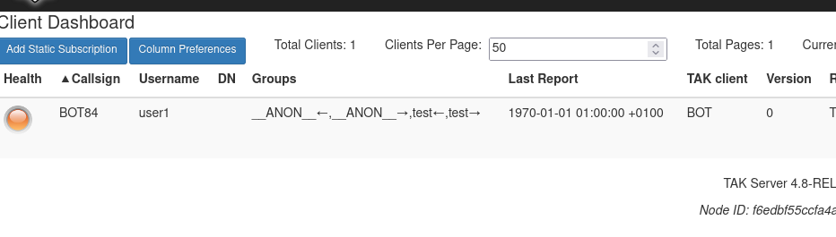

# CoT route simulator

This script takes a KML file containing a placemark with a linestring, and uses it to place a user defined number of bots around the route which are pushed to a TAK server using Cursor-on-Target XML.

The bots will follow the route at a user defined interval so you could make vehicles follow a circuit...

## Requirements
 - A TAK server IP with SSL (https://github.com/Cloud-RF/tak-server)
 - The CA file named as ca.pem
 - User certificates named as simulator.pem and simulator.key
 - A KML file containing a single path, no folders etc.

## Installation
 1. Place your three SSL files into the `ssl` folder.
 2. Install python3 dependencies
 3. Create a hosts entry in /etc/hosts for takserver and your server IP to pass SSL validation

    
 #

    pip3 install pykml requests

## Usage

    python3 simulate.py kml/NYC_Marathon.kml takserver

### Notes
The interval, number of bots and TCP port can be changed within the top of the script. 
The CoT message can be edited. Be careful as bad CoT may get silently dropped.

## Known issues

### TAK server reports one client only
This is normal as many UIDs are reporting over a single TLS connection with a single cert. 

### CERTIFICATE_VERIFY_FAILED

    Traceback (most recent call last):
    File "simulate.py", line 102, in <module>
        s.connect((TAK_SERVER_ADDRESS, TAK_SERVER_PORT))
    File "/usr/lib/python3.8/ssl.py", line 1342, in connect
        self._real_connect(addr, False)
    File "/usr/lib/python3.8/ssl.py", line 1333, in _real_connect
        self.do_handshake()
    File "/usr/lib/python3.8/ssl.py", line 1309, in do_handshake
        self._sslobj.do_handshake()
    ssl.SSLCertVerificationError: [SSL: CERTIFICATE_VERIFY_FAILED] certificate verify failed: IP address mismatch, certificate is not valid for 'X.X.X.X'. (_ssl.c:1131)

Create an entry in /etc/hosts for your takserver. The common name in the SSL certificate needs to match your entry. The default CN for the Cloud-RF Takserver Docker is 'takserver' so your hosts file should read like:

    127.0.0.1  localhost
    x.x.x.x    takserver

### 

## License

Published under the MIT license. Copyright 2023 Farrant Consulting Ltd